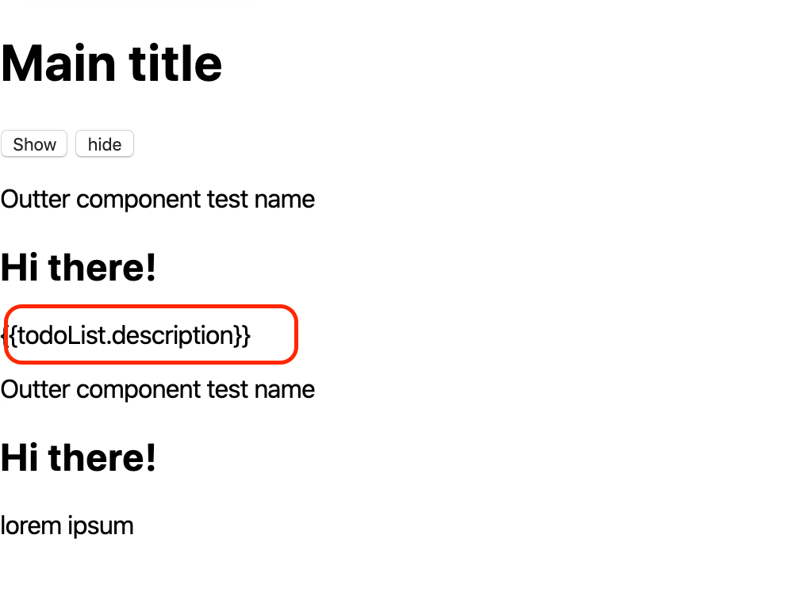
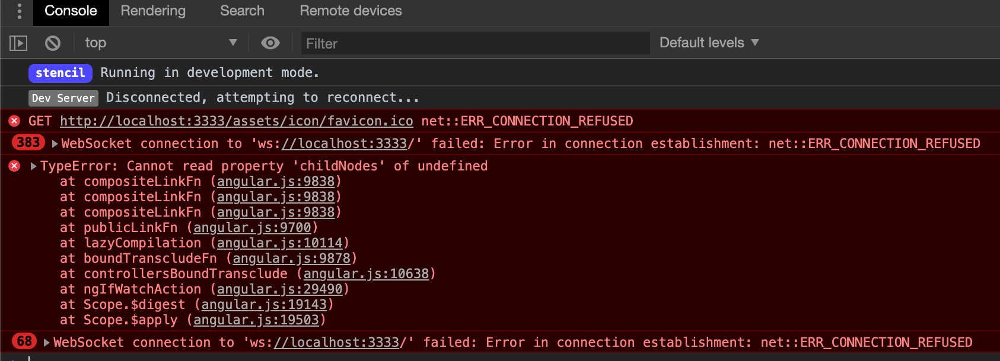

# Stencil App Starter

I’ve isolated the problem in this small repo where there is no Rabobank code related. Just a stencil app with a very small and simple component where I included the angularjs framework.

We are using `ng-if` directive to conditionally render a stencil component. This causes the angularjs interpolation in the slotted content not to work correctly. We have found that using ng-show does not cause this problem cause nodes are never removed, however this is not a viable workaround for our organization. We’ve also tried using the extra config option for Stencil (cloneNodeFix).

We would expect angularjs interpolation expressions to work when used inside a slot of a component.

However the output we see is this one:

